### PUSHK experimental filter 'pushk2exp1fnt'

Author: Viktor Glebov
Date: 12 May 2026

## CP866 Glyph coder


<b>Краткое описание алгоритма</b>

Сканируем все 256 символов шрифта
Находим горизонтальную либо вертикальную границу - линию симметрии символа
Выполняем побитовую операцию "XOR" для левой/верхней части символа

Для генерации / восстановления символов ( attr.bin ) :  
 * используем таблицу аттрибутов ~32..48 байта   
 * используем 2 конфигурационных байта для символов псевдографики 

<br>


| argc  | argv - Input / Command              | File Type | Output file |
|-------|-------------------------------------|-----------|-------------|
| [ 0 ] | appname - pushk2exp1fnt             |  -        | -           |
| [ 1 ] | command - 's'/'m'/'v'               |  -        | -           |
| [ 2 ] | Source: .c16 font file              |  .c16     | _font.c16   |
| [ 3 ] | Result: 256 attrs block             |  .bin     | _attr.bin   |
| [ 4 ] | Result: orig B&W                    |  .bmp     | _orig.bmp   |
| [ 5 ] | Result: highlighted                 |  .bmp     | _high.bmp   |
| [ 6 ] | Result: mirr B&W                    |  .bmp     | _mirr.bmp   |
| [ 7 ] | Result: original                    |  .cells   | _orig.cells |
| [ 8 ] | Result: highlight                   |  .cells   | _high.cells |
| [ 9 ] | Result: split                       |  .cells   | _mirr.cells |

<br>

##### Затенение

Символы с 176 по 178


##### Оптимизация псевдографики 

Символы с 179 по 218 включительно

<b>Структура свойств символов псевдографики</b>

197 - Пересечение одинарное     - Определяем центральную точку  
206 - Пересечение двойное       - Определяем центральную точку  

<br>

##### Фильтры симметрии

<small>

| ID | Enum        | Type                | Layout / Scheme | Description |
|----|-------------|---------------------|-----------------|-------------|
| 0  | `noattr`    | Raw                 | `++++++++`      | No transformation applied. Original 8×8 glyph stored as-is without symmetry analysis or XOR processing. |
| 1  | `hsplit`    | Horizontal Split    | `++++....`      | Glyph split into two equal vertical halves without XOR transform.<br>Left part stored directly, right part reconstructed separately. Useful for partially symmetric glyphs. |
| 2  | `hattr404`  | Horizontal Symmetry | `++++####`      | Vertical symmetry with 4-pixel mirrored halves.<br>Left half stored directly, right half encoded using XOR residual against mirrored source. No central axis column. |
| 3  | `hattr313`  | Horizontal Symmetry | `+++A###.`      | Vertical symmetry using 3-pixel halves with 1-pixel central axis column.<br>Right side encoded as XOR residual relative to mirrored left side. |
| 4  | `hattr303`  | Horizontal Symmetry | `+++###..`      | Compact vertical symmetry mode without explicit axis column. Uses 3-pixel mirrored regions with XOR residual encoding.<br>Optimized for narrow symmetric glyphs. |
| 5  | `vattr313`  | Vertical Symmetry   | `3+1+3 rows`    | Horizontal axis symmetry mode.<br>Top and bottom parts processed using XOR residual transform with 1 central axis row preserved separately. |
| 6  | `vattr413`  | Vertical Symmetry   | `4+1+3 rows`    | Asymmetric vertical split mode using 4 rows on one side and 3 mirrored XOR rows on the opposite side with preserved axis row. |
| 7  | `vattr404`  | Vertical Symmetry   | `4+4 rows`      | Full horizontal-axis symmetry mode with equal top/bottom regions.<br>Bottom half encoded using XOR residual relative to mirrored top half. |

</small>

<br>


### Fonts examples

<table>
    <tr>
        <td width="512"><b>Original font example</b></td>
        <td width="512"><b>Analysis</b></td>
    </tr>
    <tr>
        <td width="50%">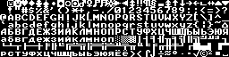</td>
        <td width="50%">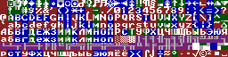</td>
    </tr>
    <tr>
        <td width="50%">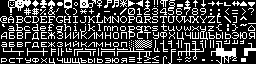</td>
        <td width="50%">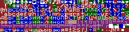</td>
    </tr>
    <tr>
        <td width="50%">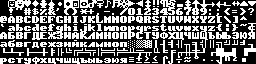</td>
        <td width="50%">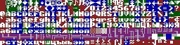</td>
    </tr>
    <tr>
        <td width="50%">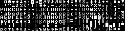</td>
        <td width="50%">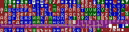</td>
    </tr>
    <tr>
        <td width="50%">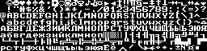</td>
        <td width="50%">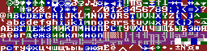</td>
    </tr>
    <tr>
        <td width="50%">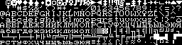</td>
        <td width="50%">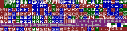</td>
    </tr>
    <tr>
        <td width="50%">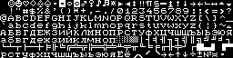</td>
        <td width="50%">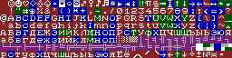</td>
    </tr>
    <tr>
        <td width="50%">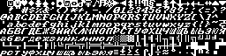</td>
        <td width="50%">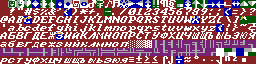</td>
    </tr>
</table>

<br>


##### System archivers

<small>

| Archiver | Version | Max Level | Info |
|-----|-----|-----|-----|
| zip | 3.0 | -9 | This is Zip 3.0 (July 5th 2008), by Info-ZIP. |
| rar | 7.00 | -m5 | RAR 7.00   Copyright (c) 1993-2024 Alexander Roshal   26 Feb 2024 |
| lzma | 5.4.5 | -9 | xz (XZ Utils) 5.4.5 |
| 7z | 23.01 | -mx9 | 7-Zip 23.01 (x64) : Copyright (c) 1999-2023 Igor Pavlov : 2023-06-20 |
| xz | 5.4.5 | -9 | xz (XZ Utils) 5.4.5 |
| zstd | 1.5.5 | --ultra -22 | *** Zstandard CLI (64-bit) v1.5.5, by Yann Collet *** |
| brotli | 1.1.0 | -q 11 | brotli 1.1.0 |
| bzip2 | 1.0.8 | -9 | bzip2, a block-sorting file compressor.  Version 1.0.8, 13-Jul-2019. |
| gzip | 1.12 | -9 | gzip 1.12 |
| arj | 3.10 | -jm | ARJ32 v 3.10, Copyright (c) 1998-2004, ARJ Software Russia. |

</small>

<br>

##### Compression benchmarks

<small>

| fname | orig | zip | rar | lzma | 7z | xz | zstd | brotli | bzip2 | gzip | arj |
|---|---|---|---|---|---|---|---|---|---|---|---|
| font1def.c16_orig.cells | 16384 | 1755 | 1567 | 1380 | 1505 | 1428 | 1371 | 1341 | 1618 | 1601 | 1736 |
| font1def.c16_mirr.cells | 16384 | 1563 | 1409 | 1284 | 1414 | 1328 | 1219 | 1207 | 1387 | 1410 | 1547 |
| font1def.c16_orig_b.cells | 16384 | 1589 | 1410 | 1261 | 1374 | 1308 | 1251 | 1208 | 1432 | 1433 | 1564 |
| font1def.c16_mirr_b.cells | 16384 | 1377 | 1226 | 1102 | 1229 | 1148 | 1078 | 1038 | 1191 | 1221 | 1353 |
| font2sml.c16_orig.cells | 16384 | 1824 | 1639 | 1472 | 1593 | 1516 | 1419 | 1358 | 1724 | 1671 | 1811 |
| font2sml.c16_mirr.cells | 16384 | 1620 | 1491 | 1348 | 1490 | 1396 | 1284 | 1264 | 1489 | 1466 | 1613 |
| font2sml.c16_orig_b.cells | 16384 | 1699 | 1518 | 1367 | 1478 | 1412 | 1342 | 1287 | 1543 | 1543 | 1669 |
| font2sml.c16_mirr_b.cells | 16384 | 1470 | 1326 | 1199 | 1328 | 1244 | 1132 | 1112 | 1271 | 1314 | 1444 |
| font3bld.c16_orig.cells | 16384 | 1840 | 1643 | 1434 | 1557 | 1480 | 1441 | 1418 | 1678 | 1686 | 1825 |
| font3bld.c16_mirr.cells | 16384 | 1621 | 1464 | 1330 | 1456 | 1376 | 1299 | 1262 | 1478 | 1468 | 1608 |
| font3bld.c16_orig_b.cells | 16384 | 1640 | 1442 | 1286 | 1405 | 1332 | 1296 | 1247 | 1500 | 1484 | 1615 |
| font3bld.c16_mirr_b.cells | 16384 | 1463 | 1288 | 1162 | 1290 | 1208 | 1134 | 1101 | 1278 | 1307 | 1428 |
| font4sml.c16_orig.cells | 16384 | 1613 | 1389 | 1255 | 1379 | 1300 | 1272 | 1181 | 1436 | 1459 | 1602 |
| font4sml.c16_mirr.cells | 16384 | 1488 | 1318 | 1204 | 1331 | 1248 | 1166 | 1112 | 1306 | 1334 | 1467 |
| font4sml.c16_orig_b.cells | 16384 | 1478 | 1272 | 1146 | 1274 | 1192 | 1163 | 1091 | 1285 | 1322 | 1458 |
| font4sml.c16_mirr_b.cells | 16384 | 1317 | 1148 | 1054 | 1185 | 1100 | 1026 | 982 | 1097 | 1161 | 1296 |
| font5def.c16_orig.cells | 16384 | 1807 | 1609 | 1413 | 1531 | 1460 | 1422 | 1367 | 1667 | 1653 | 1787 |
| font5def.c16_mirr.cells | 16384 | 1626 | 1464 | 1303 | 1433 | 1348 | 1270 | 1240 | 1437 | 1472 | 1610 |
| font5def.c16_orig_b.cells | 16384 | 1650 | 1452 | 1300 | 1413 | 1348 | 1285 | 1240 | 1483 | 1494 | 1624 |
| font5def.c16_mirr_b.cells | 16384 | 1438 | 1271 | 1159 | 1292 | 1204 | 1113 | 1085 | 1244 | 1282 | 1412 |
| font6ang.c16_orig.cells | 16384 | 1896 | 1721 | 1541 | 1663 | 1588 | 1486 | 1431 | 1779 | 1743 | 1867 |
| font6ang.c16_mirr.cells | 16384 | 1685 | 1551 | 1397 | 1522 | 1444 | 1330 | 1303 | 1529 | 1531 | 1668 |
| font6ang.c16_orig_b.cells | 16384 | 1730 | 1524 | 1373 | 1493 | 1420 | 1369 | 1308 | 1567 | 1574 | 1705 |
| font6ang.c16_mirr_b.cells | 16384 | 1505 | 1358 | 1226 | 1363 | 1272 | 1169 | 1142 | 1313 | 1349 | 1483 |
| font7sml.c16_orig.cells | 16384 | 1746 | 1592 | 1400 | 1537 | 1448 | 1379 | 1341 | 1624 | 1592 | 1732 |
| font7sml.c16_mirr.cells | 16384 | 1562 | 1425 | 1282 | 1409 | 1328 | 1218 | 1225 | 1402 | 1408 | 1535 |
| font7sml.c16_orig_b.cells | 16384 | 1646 | 1447 | 1287 | 1405 | 1332 | 1243 | 1190 | 1417 | 1490 | 1628 |
| font7sml.c16_mirr_b.cells | 16384 | 1436 | 1276 | 1162 | 1282 | 1208 | 1096 | 1058 | 1221 | 1280 | 1422 |
| font8kur.c16_orig.cells | 16384 | 1916 | 1755 | 1544 | 1664 | 1592 | 1532 | 1509 | 1772 | 1762 | 1899 |
| font8kur.c16_mirr.cells | 16384 | 1766 | 1615 | 1452 | 1570 | 1500 | 1411 | 1354 | 1595 | 1612 | 1747 |
| font8kur.c16_orig_b.cells | 16384 | 1762 | 1598 | 1428 | 1550 | 1472 | 1406 | 1374 | 1614 | 1606 | 1740 |
| font8kur.c16_mirr_b.cells | 16384 | 1614 | 1454 | 1316 | 1434 | 1364 | 1252 | 1234 | 1438 | 1458 | 1590 |

</small>

*Notes:*
"_orig.cells" - original .cells font file  
"_mirr.cells" - optimized .cells font file ( additionally ~32..50 bytes stored in _attr.bin for recovery )  
"_b.cells" files - transformed layout with pushk2pre1move filter / cl_filter_b.yaml  

<br>


##### Конфигурационный байт - псевдографика

```cpp
struct psmeta {
    uint8_t cpointx : 2;    // 2, 3, 4, 5
    uint8_t cpointy : 2;    // 2, 3, 4, 5
    uint8_t wdtx : 1;       // 1 / 2
    uint8_t wdty : 1;       // 1 / 2
    uint8_t spcx : 1;       // 1 / 2
    uint8_t spcy : 1;       // 1 / 2
};
```

##### Конфигурационный байт для одинарных линий (Single)  

X1  2 бита : значения 2 | 3 | 4 | 5
Y1  2 бита : значения 2 | 3 | 4 | 5
V1  1 бит  : толщина по X
W1  1 бит  : толщина по Y
R   1 бит  : резерв / not used
R   1 бит  : резерв / not used

##### Конфигурационный байт для двойных линий (Double)  

X2  2 бита : значения 2 | 3 | 4 | 5
Y2  2 бита : значения 2 | 3 | 4 | 5
V2  1 бит  : толщина по X
W2  1 бит  : толщина по Y
SX  1 бит  : разделитель X
SY  1 бит  : разделитель Y


<b>Corners</b>

<table>
<tr><td>1</td><td>-</td><td>3</td></tr>
<tr><td>-</td><td>-</td><td>-</td></tr>
<tr><td>7</td><td>-</td><td>9</td></tr>
</table>

<br>

##### Запрос Copilot для генерации класса BMPBW

Задача: сгенерируй bmpbw.hpp класс C++17 BMPBW

* класс должен генерировать монохромный .bmp файл ( B/W 1-bit 256х64 )
* параметр функции generate() - std::vector<uint8_t> arrin
* arrin - это массив std::vector<uint8_t> размером 16384 ( 256*64 )
* содержимое .bmp должно быть в виде std::vector<uint8_t>
* содержимое можно записать в файл командой saveToFile
* учти что формат bmp отображает изображение снизу вверх

Уточнения:
* не использовать исключения ( throw )

<br>

##### Запрос Copilot для генерации класса .cells

Задача: сгенерируй cells.hpp класс C++17 CELLS256

* класс должен содержать внутри массив ( private ) в виде std::vector<uint8_t> arr
* arr - это массив для хранения 256 ячеек
* размер ячейки = 64 (8*8 байт)
* Первые 2048 байт - это первые строки всех 256 ячеек
* Следующие 2048 байт - это вторые строки всех 256 ячеек ... и так далее
* функции прямого доступа к arr
* функции setPixel(x,y,val) и getPixel(x,y)
* функции loadFromFile и saveToFile

Уточнения:
* не использовать исключения ( throw )


2026 V01G04A81